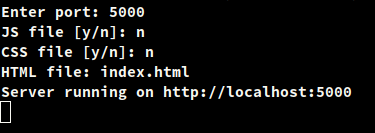
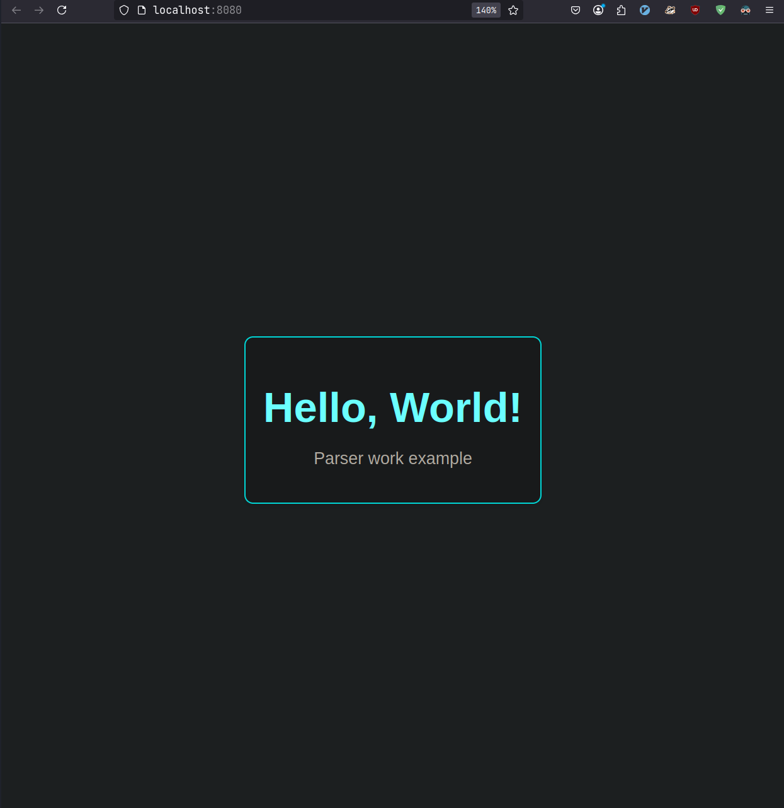

# Parser

**python код запускает localhost страничку**
___

## Зависимости: 
   
-  **Компилятор:**  **GCC**, **clang** (MinGW -Windows)
-  **Python 3.XX.x**

___
## Установка 
```bash
git clone https://github.com/yinmus/HTML-parser.git
```
**Компиляция**
```bash
make
```
**Запуск**

```bash
make run
```
```bash
python server.py
```


**Очистка**
```bash
make clean
```

___
## example:

___
## examples
**HTML files:**
- **[Directory](examples/)**
  - ***[HTML example file - 1](examples/html/index.html)***
  - ***[HTML example file - 2](examples/html/index2.html)***


**CSS files:**

- **[Directory](examples/)**
  - ***[CSS example file - 1](examples/css/styles.css)***
  - ***[CSS example file - 2](examples/css/styles2.css)***
 


#### More..
[Docs](docs.md)
